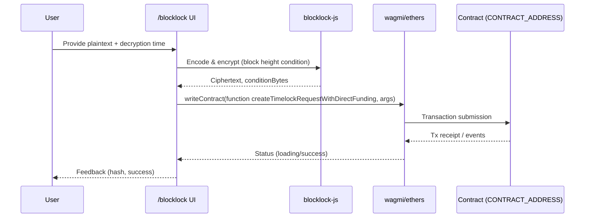

BLOCKLOCK_FRONTEND_KIT.md
=========================

1) Front Matter & Snapshot
--------------------------

**Title:** _blocklock-frontend-kit — Complete Technical Documentation_

* **Repository:** [https://github.com/rk-rishikesh/blocklock-frontend-kit](https://github.com/rk-rishikesh/blocklock-frontend-kit) (default branch: `main`).
    
* **HEAD commit:** `af7de6121b558ed5a42a5e49a7c7a1619ec516a1` — “Updated to Responsive CSS”. Git patch shows authored time **2025‑07‑30 12:08:14 +05:30**, i.e., **2025‑07‑30 06:38:14 UTC**.
    
* **Languages (GitHub breakdown):** TypeScript ~91.4%, Solidity ~5.4%, CSS ~1.8%, JavaScript ~1.4%.
    
* **Detected tech stack (from code & files):** Next.js (App Router), TypeScript, Tailwind CSS, ESLint, PostCSS, TanStack React Query, wagmi, ethers, `blocklock-js`. Evidence includes presence of `app/` directory, `tailwind.config.ts`, `eslint.config.mjs`, `postcss.config.mjs`, and imports in `app/blocklock/page.tsx` (`wagmi`, `ethers`, `blocklock-js`) and `app/ReactQueryProvider.tsx` (`@tanstack/react-query`).
    
* **License:** **Not found in repository** (no `LICENSE` file shown in root listing).
    
* **Version & package metadata:** **TODO (needs verification)** — `package.json` exists but its contents were not retrievable via GitHub HTML viewer in this environment.
    
* **How this doc was produced:** Automated repo review (web browsing of GitHub UI and commit diffs) on **2025‑08‑12**; compiled by GPT‑5 Pro.
    
* **Doc checksum:** **TODO** — compute after saving this file, e.g.
    
    ```bash
    shasum -a 256 BLOCKLOCK_FRONTEND_KIT.md | cut -c1-12
    ```
    

* * *

Table of Contents
-----------------

1. [Front Matter & Snapshot](#1-front-matter--snapshot)
    
2. [Executive Summary](#2-executive-summary)
    
3. [Quickstart](#3-quickstart)
    
4. [Repository Map (with Roles)](#4-repository-map-with-roles)
    
5. [Architecture Overview](#5-architecture-overview)
    
6. [Dependency Inventory & Rationale](#6-dependency-inventory--rationale)
    
7. [Scripts & Tooling](#7-scripts--tooling)
    
8. [Components Catalog (UI API Reference)](#8-components-catalog-ui-api-reference)
    
9. [Hooks & Utilities (Runtime API Reference)](#9-hooks--utilities-runtime-api-reference)
    
10. [Routing & Pages](#10-routing--pages-if-applicable)
    
11. [State Management](#11-state-management)
    
12. [Styling & Theming](#12-styling--theming)
    
13. [Internationalization (i18n)](#13-internationalization-i18n)
    
14. [Accessibility (a11y)](#14-accessibility-a11y)
    
15. [Error Handling & Observability](#15-error-handling--observability)
    
16. [Security](#16-security)
    
17. [Performance & Bundling](#17-performance--bundling)
    
18. [Configuration & Environments](#18-configuration--environments)
    
19. [Testing Strategy](#19-testing-strategy)
    
20. [Build, Release & Deployment](#20-build-release--deployment)
    
21. [Extensibility Guide (LLM-Ready Playbooks)](#21-extensibility-guide-llm-ready-playbooks)
    
22. [Recipes (Copy-Paste Examples)](#22-recipes-copy-paste-examples)
    
23. [Maintenance & Project Hygiene](#23-maintenance--project-hygiene)
    
24. [Changelog Snapshot](#24-changelog-snapshot)
    
25. [Open Questions & TODOs](#25-open-questions--todos)
    
26. [Glossary](#26-glossary)
    
27. [LLM Index & Chunking Hints](#27-llm-index--chunking-hints)
    
28. [Appendices](#28-appendices)
    

* * *

2) Executive Summary
--------------------

**What it is.** `blocklock-frontend-kit` is a Next.js (App Router) starter that demonstrates **timelock encryption** flows using the `blocklock-js` SDK alongside **ethers** and **wagmi** for contract interaction and wallet connectivity. It includes a `/blocklock` page that encrypts a value and submits a request to a smart contract method `createTimelockRequestWithDirectFunding`, plus a small provider setup for React Query. The app uses Tailwind for styling. Evidence: presence of `/app/blocklock/page.tsx` using `Blocklock`, `ethers`, `wagmi`, and the `ReactQueryProvider` component.

**Who it’s for.** Frontend engineers integrating **Blocklock timelock encryption** into dApps, teams needing a minimal Next.js kit with wallet connection and contract calls, and researchers evaluating the Blocklock UX end‑to‑end.

**Primary capabilities.**

* UI to enter plaintext and a decryption time, **encrypt it client‑side**, and **call a contract** with the resulting ciphertext + condition bytes. The code constructs `blockHeight`, encodes a value, encrypts with `Blocklock`, builds `conditionBytes` via `encodeCondition`, and calls the contract.
    
* React Query provider bootstrapped for data fetching/memoization in client components.
    
* Tailwind-based layout and assets. Presence of `tailwind.config.ts` and extensive `public/assets`.
    

**Maturity & limitations.**

* Early-stage starter: very small README and minimal docs in-repo.
    
* Missing LICENSE and visible CI/test setup. **Not found in repository.**
    

* * *

3) Quickstart
-------------

> This section favors **exact facts** where confirmed. Anything else is clearly marked.

### Prerequisites

* **Node.js:** **TODO (needs verification)** — `package.json` not viewable; use Node 18+ for modern Next.js as a safe baseline.
    
* **Package manager:** npm/pnpm/yarn (**any**; scripts unknown). **TODO (needs verification)**.
    

### Install & bootstrap

```bash
# choose one, according to your workflow
npm install
# or
pnpm install
# or
yarn install
```

### Development server

```bash
# typical Next.js scripts (verify in package.json)
npm run dev
```

* Default URL (Next.js): [http://localhost:3000](http://localhost:3000) (**typical**; verify locally). **TODO (needs verification)**.
    

### Build & preview

```bash
npm run build
npm start
# or Next's preview if defined
```

**TODO (needs verification)** for exact script names.

### Minimal “Hello World” using a shipped component

```tsx
// app/page.tsx
import React from 'react'
import Header from './blocklock/header' // simple header component

export default function Home() {
  return (
    <main>
      <Header />
      <h1 className="text-2xl font-bold mt-6">Hello Blocklock</h1>
    </main>
  )
}
```

`Header` exists at `app/blocklock/header.tsx` (no props).

### .env handling

A sample env file exists with WalletConnect config:

```ini
# .env.sample
# WalletConnect Configuration
NEXT_PUBLIC_WALLET_CONNECT_PROJECT_ID=25c0b0d0df665b90fd6d59f93d8f71bf
```

Copy to `.env.local` and update the value as needed.

* * *

4) Repository Map (with Roles)
------------------------------

> Based on initial commit tree and current root listing.

```
.
├─ app/
│  ├─ ReactQueryProvider.tsx         # React Query bootstrap provider
│  ├─ blocklock/
│  │  ├─ header.tsx                 # Simple fixed header component (logo link)
│  │  ├─ page.tsx                   # Timelock encryption UI & contract write flow
│  │  └─ x.tsx                      # Present but content unknown (likely experimental/demo)
│  ├─ favicon.ico
│  ├─ globals.css
│  ├─ index.tsx                     # Present; exact role unknown in App Router (might be internal helper)
│  ├─ layout.tsx                    # Next.js root layout (standard in App Router)
│  ├─ page.tsx                      # Home page
│  ├─ providers.tsx                 # Likely app-wide providers (wagmi/theme/query) — TODO verify
│  └─ wallet.tsx                    # Wallet UI used by /blocklock — imported as `Wallet` — TODO verify
├─ components/
│  ├─ header.tsx                    # Another header; possibly for non-blocklock pages — TODO compare
│  └─ walletConnect.tsx             # WalletConnect-related UI — TODO verify props/behavior
├─ lib/
│  ├─ MockBlocklockStringReceiver.sol # Solidity example (mock)
│  └─ contract.ts                   # Exports CONTRACT_ABI & CONTRACT_ADDRESS used by /blocklock
├─ public/
│  └─ assets/...                    # Backgrounds, images, logos
├─ .env.sample                      # WalletConnect Project ID sample
├─ eslint.config.mjs
├─ next.config.ts
├─ package.json
├─ postcss.config.mjs
├─ tailwind.config.ts
└─ tsconfig.json
```

Sources: root listing and “Frontend Setup” commit file tree.

* * *

5) Architecture Overview
------------------------

### 5.1 Component graph (Mermaid)

```mermaid
graph TD
  A[app/layout.tsx] --> B[app/providers.tsx]
  B --> C[ReactQueryProvider]
  A --> D[app/page.tsx]
  A --> E[/blocklock route: app/blocklock/page.tsx]
  E --> F[Header (app/blocklock/header.tsx)]
  E --> G[Wallet (app/wallet.tsx)]
  E --> H[lib/contract.ts (ABI, ADDRESS)]
  E --> I[blocklock-js (SDK)]
  E --> J[ethers + wagmi]
  A --> K[components/header.tsx]
```

* `app/blocklock/page.tsx` imports `Blocklock` from `blocklock-js`, reads/writes via `wagmi`/`ethers`, and uses `CONTRACT_ABI` & `CONTRACT_ADDRESS` from `lib/contract`.
    
* `ReactQueryProvider` wraps the app to enable query caching.
    

### 5.2 Data flow (Mermaid)



Logic reflected in `handleEncrypt` (constructs `blockHeight`, encodes with `SolidityEncoder`, encrypts using `Blocklock`, builds `conditionBytes`, then `writeContract`).

### 5.3 State, routing, styling, SSR

* **State:** Local React state in `/blocklock` page; app-wide **React Query** via `ReactQueryProvider`.
    
* **Routing:** Next.js **App Router** (`app/` with `page.tsx` per route). `/blocklock` is defined by `app/blocklock/page.tsx`.
    
* **Styling:** **Tailwind CSS** (presence of `tailwind.config.ts`, `globals.css`).
    
* **SSR/SSG/ISR:** Not explicitly configured in visible code; page uses `"use client"` so it’s **client‑side**.
    

* * *

6) Dependency Inventory & Rationale
-----------------------------------

> Based on imports and standard Next.js kit expectations. Exact versions: **TODO (needs verification)** (package.json not visible).

| Package | Role / Rationale | Evidence |
| --- | --- | --- |
| `next`, `react`, `react-dom` | App framework & React runtime | App Router structure (`app/`), typical Next stack. **TODO verify versions**. |
| `tailwindcss`, `postcss`, `autoprefixer` | Styling system & PostCSS pipeline | Config files present. |
| `@tanstack/react-query` | Client caching/provider | Imported in `app/ReactQueryProvider.tsx`. |
| `wagmi` | Wallet/account/contract utils | Imported in `/blocklock/page.tsx`. |
| `ethers` | EVM provider/signer & utils | Imported in `/blocklock/page.tsx`. |
| `blocklock-js` | Timelock encryption SDK | Imported in `/blocklock/page.tsx`. |
| `eslint` (+ config) | Linting | `eslint.config.mjs` present. |
| `typescript` | Types | `tsconfig.json` present. |
| (WalletConnect library) | WalletConnect integration | `.env.sample` contains WalletConnect project id; component `components/walletConnect.tsx` exists. **TODO verify exact lib**. |

**Security-sensitive**: Encryption & ciphertext handling via `blocklock-js`. Consider reviewing how ciphertext is serialized (`encodeCiphertextToSolidity`) and validated on-chain.

**Build toolchain:** Next.js build system (standard). **TODO (needs verification)** for any extra plugins.

* * *

7) Scripts & Tooling
--------------------

**All `package.json` scripts:** **TODO (needs verification)** — file present but not rendered in this environment. Expected (typical Next): `dev`, `build`, `start`, `lint`.

**Linting/formatting:** ESLint configured via `eslint.config.mjs`. **Prettier:** **Not found in repository** (no config detected).

**TypeScript config:** `tsconfig.json` present; highlights **TODO (needs verification)**.

**Testing:** No test framework visible; **Not found in repository** (no `jest`, `vitest`, or e2e configs visible in root list).

**CI/CD:** No workflows surfaced in root listing; **Not found in repository**.

* * *

8) Components Catalog (UI API Reference)
----------------------------------------

> This section lists **exported** components we could confirm from code diffs and tree. Where signatures aren’t visible, items are marked **TODO**.

### 8.1 `app/blocklock/header.tsx` — `Header`

* **Export:** `default`
    
* **Props:** _none_ (no props used in code).
    
* **Description:** Fixed top header with logo linking to `/`. Uses `next/image` and `next/link`.
    
* **Props table:**
    

| Prop | Type | Default | Required | Description |
| --- | --- | --- | --- | --- |
| — | — | — | — | No props. |

* **Example:**
    

```tsx
import Header from './blocklock/header'
export default function Page(){ return (<><Header/><main>...</main></>) }
```

* **Styling:** Tailwind classes (`fixed top-0 w-full h-20 ...`).
    
* **A11y:** Provides `alt` text on `Image`. No keyboard interaction; acts as link via `Link`.
    
* **Source:** `app/blocklock/header.tsx`.
    

* * *

### 8.2 `app/ReactQueryProvider.tsx` — `ReactQueryProvider`

* **Export:** `default`
    
* **Signature:** `(props: { children: React.ReactNode }) => JSX.Element`
    
* **Description:** Initializes a `QueryClient` and wraps children in `QueryClientProvider`. Also defines a `BigInt.prototype.toJSON` shim (stringify BigInt).
    
* **Props table:**
    

| Prop | Type | Default | Required | Description |
| --- | --- | --- | --- | --- |
| `children` | `React.ReactNode` | — | Yes | Descendant React tree. |

* **Example:**
    

```tsx
// app/providers.tsx (pattern)
import ReactQueryProvider from './ReactQueryProvider'
export default function Providers({children}:{children:React.ReactNode}) {
  return <ReactQueryProvider>{children}</ReactQueryProvider>
}
```

* **Performance:** Single `QueryClient` created via `useState` to keep a stable instance.
    
* **Source:** `app/ReactQueryProvider.tsx`.
    

* * *

### 8.3 `app/blocklock/page.tsx` — `BlockLockPage`

* **Export:** `default` (Next.js page component; `"use client"`)
    
* **Key UI/logic:**
    
    * Tabs (string state `activeTab`) for modes including `'text'`.
        
    * Controlled inputs for plaintext and **decryption time**.
        
    * **Encrypt flow** (`handleEncrypt`):
        
        1. Ensure plaintext/time present, wallet connected (`useWalletClient`, `useAccount`)
            
        2. `ethers.BrowserProvider` from wallet transport
            
        3. `blockHeight = BigInt(currentBlock + 20)`
            
        4. `SolidityEncoder.encodeUint256(parseEther("4"))` → `Uint8Array`
            
        5. `new Blocklock(signer, "0x82Fe...e27e", BigInt(84532))` → `ciphertext = encrypt(encodedMessage, blockHeight)`
            
        6. `conditionBytes = encodeCondition(blockHeight)`
            
        7. `writeContract({ fn: 'createTimelockRequestWithDirectFunding', args: [callbackGasLimit, conditionBytes, encodeCiphertextToSolidity(ciphertext)] })`  
            Evidence from diff.
            
* **Props:** None (Next page).
    
* **A11y:** Standard inputs with labels; ensure focus management after action (future improvement).
    
* **Known pitfalls:** Ensure chain ID matches the deployed Blocklock contract; chain id in snippet: `84532` (Base Sepolia). **TODO verify network selection UI.**
    
* **Source:** `app/blocklock/page.tsx`.
    

* * *

### 8.4 `app/wallet.tsx` — `Wallet`

* **Export:** Presumed default; imported in `app/blocklock/page.tsx` as `Wallet`. **TODO (needs verification)**.
    
* **Purpose:** Wallet connection UI; likely uses wagmi and WalletConnect. **TODO**.
    
* **Props:** **TODO**
    
* **A11y & Performance:** **TODO**
    
* **Source:** `app/wallet.tsx`.
    

* * *

### 8.5 `components/header.tsx`

* **Export/Props:** **TODO**
    
* **Purpose:** Alternative/legacy header outside the `blocklock` folder. **TODO**
    
* **Source:** `components/header.tsx`.
    

* * *

### 8.6 `components/walletConnect.tsx`

* **Export/Props:** **TODO**
    
* **Purpose:** WalletConnect helper UI (inferred from filename + env sample). **TODO verify implementation**.
    
* **Source:** `components/walletConnect.tsx`.
    

* * *

9) Hooks & Utilities (Runtime API Reference)
--------------------------------------------

### 9.1 `lib/contract.ts`

* **Exports:** `CONTRACT_ABI`, `CONTRACT_ADDRESS` (inferred from import path in `/blocklock/page.tsx`).
    
* **Signature/Types:** **TODO (needs verification)** — ABI shape and address string.
    
* **Side effects:** None expected (pure constants).
    
* **Use:** Imported by `/blocklock` page, fed into wagmi `useReadContract` and `writeContract`.
    
* **Errors:** Contract calls may revert; handled via wagmi error surfaces.
    
* **Source:** `lib/contract.ts`.
    

### 9.2 `lib/MockBlocklockStringReceiver.sol`

* **Purpose:** Solidity mock contract for demo/testing integration. **TODO** for function list.
    
* **Source:** `lib/MockBlocklockStringReceiver.sol`.
    

* * *

10) Routing & Pages (if applicable)
-----------------------------------

| Route | File | Layout | Guard/Middleware | Notes |
| --- | --- | --- | --- | --- |
| `/` | `app/page.tsx` | `app/layout.tsx` | — | Home. **TODO content**. |
| `/blocklock` | `app/blocklock/page.tsx` | `app/layout.tsx` | — | Timelock encryption workflow. |

**SEO/Metadata:** Not observed (no `metadata` export seen). **TODO verify**.

* * *

11) State Management
--------------------

* Local component state in `/blocklock` for UI fields.
    
* **React Query** present via `ReactQueryProvider`; no queries are shown in visible diffs, but provider scaffold enables future server data patterns.
    

**Persistence/Hydration:** None observed. **TODO verify** if any localStorage usage.

**Testing patterns:** Not present. **TODO**.

* * *

12) Styling & Theming
---------------------

* Tailwind CSS is enabled (`tailwind.config.ts`, `postcss.config.mjs`, `globals.css`).
    
* The HEAD commit also touched `tailwind.config.ts` (1 line added). Exact change unknown from UI snapshot.
    

**Tokens/Breakpoints/Plugins:** **TODO (needs verification)** (inspect `tailwind.config.ts`).

**Dark mode / theming:** **TODO**.

* * *

13) Internationalization (i18n)
-------------------------------

**N/A** — no i18n libs or locale files surfaced. **TODO if added later.**

* * *

14) Accessibility (a11y)
------------------------

* Components use semantic elements and `alt` on images in `Header`.
    
* For forms and tabs in `/blocklock`, add `aria-*` attributes, labels, and keyboard navigation cues (**recommended extension**, see Recipes).
    

* * *

15) Error Handling & Observability
----------------------------------

* `/blocklock`’s `handleEncrypt` has `try/catch` with console logging. Add user-facing error toasts and error boundary for production.
    
* No external logging/telemetry observed. **TODO**.
    

* * *

16) Security
------------

* **Secrets:** Use `.env.local` (WalletConnect Project ID). Avoid committing secrets; `.gitignore` includes env files.
    
* **XSS:** No `dangerouslySetInnerHTML` observed. Inputs are plain text; sanitize if rendering user content in future.
    
* **CORS:** Frontend SPA making on-chain calls; if adding APIs, configure CORS appropriately.
    
* **AuthZ:** None present; wallet presence only (via wagmi).
    
* **Supply chain:** Pin dependency versions and run audits. **TODO verify lockfile**.
    

* * *

17) Performance & Bundling
--------------------------

* **Code-splitting:** Next.js automatically chunks pages; `/blocklock` is client-only, so keep imports minimal.
    
* **Images:** Uses `next/image` in `Header`; leverage optimization.
    
* **Memoization:** Add `useCallback` for handlers if prop-drilling occurs; not critical at current size.
    

* * *

18) Configuration & Environments
--------------------------------

### 18.1 Environment matrix

| Env | Notes |
| --- | --- |
| `development` | Local dev with wallet. |
| `production` | Vercel deployment link appears on repo (`blocklock-frontend-kit.vercel.app`). **TODO verify environment variables on Vercel**. |

### 18.2 Environment variables

| Name | Type | Required | Default | Used in | Notes |
| --- | --- | --- | --- | --- | --- |
| `NEXT_PUBLIC_WALLET_CONNECT_PROJECT_ID` | string | Yes | — | (WalletConnect setup; likely in `components/walletConnect.tsx` or provider) | Present in `.env.sample`. **TODO link exact usage site**. |

**`.env.example` block**

```ini
# WalletConnect
NEXT_PUBLIC_WALLET_CONNECT_PROJECT_ID=__REPLACE_ME__
```

* * *

19) Testing Strategy
--------------------

**Not found in repository.** Add unit tests for:

* `handleEncrypt` (mock `ethers` and `blocklock-js`)
    
* Contract client utils in `lib/contract.ts`
    
* Accessibility snapshots for header & forms
    

* * *

20) Build, Release & Deployment
-------------------------------

* **Build artifacts:** Next.js build (`.next/`). `.gitignore` includes `.next/` and `out/`.
    
* **Deployment:** Vercel link present on repo page; configure envs there. **TODO confirm production branch & settings**.
    
* **Versioning/release:** No tags/releases on GitHub at time of scan.
    

* * *

21) Extensibility Guide (LLM-Ready Playbooks)
---------------------------------------------

> Safe, minimal diffs. Always run lint/typecheck locally.

### 21.1 Add a new component

**Goal:** Create `components/CopyToClipboard.tsx`.

**Files to edit:**

* `components/CopyToClipboard.tsx` (new)
    
* (Optionally) export re-exports barrel if you add one.
    

**Diff:**

```diff
+ // components/CopyToClipboard.tsx
+ "use client"
+ import React from 'react'
+ 
+ export default function CopyToClipboard({text}:{text:string}) {
+   const onCopy = async () => { try { await navigator.clipboard.writeText(text) } catch {} }
+   return <button onClick={onCopy} className="px-2 py-1 border rounded">Copy</button>
+ }
```

### 21.2 Add a new page/route

**Goal:** Add `/about`.

**Files to edit:**

* `app/about/page.tsx` (new)
    

**Diff:**

```diff
+ // app/about/page.tsx
+ export default function AboutPage() {
+   return <main className="p-6"><h1 className="text-2xl font-bold">About</h1></main>
+ }
```

### 21.3 Add a new hook/service

**Goal:** Contract read hook.

**Files to edit:**

* `lib/usePlainTextValue.ts` (new)
    

**Diff:**

```diff
+ // lib/usePlainTextValue.ts
+ "use client"
+ import { useReadContract } from 'wagmi'
+ import { CONTRACT_ABI, CONTRACT_ADDRESS } from './contract'
+ 
+ export function usePlainTextValue() {
+   return useReadContract({
+     address: CONTRACT_ADDRESS,
+     abi: CONTRACT_ABI,
+     functionName: 'plainTextValue',
+   })
+ }
```

### 21.4 Add a theme token

**Files to edit:**

* `tailwind.config.ts` (extend colors)
    
* `globals.css` (CSS vars)
    

**Diff:**

```diff
- // tailwind.config.ts
  export default {
    theme: {
      extend: {
+       colors: { brand: { DEFAULT: '#1f6feb', 50: '#e8f0fe' } }
      }
    }
  }
```

### 21.5 Integrate an external API (read-only)

**Files to edit:**

* `app/api-demo/page.tsx` (client fetch)
    

**Diff:**

```diff
+ // app/api-demo/page.tsx
+ "use client"
+ import React from 'react'
+ export default function ApiDemo(){
+   const [data, setData] = React.useState<any>(null)
+   React.useEffect(()=>{
+     fetch('https://api.blocklock.example/status').then(r=>r.json()).then(setData).catch(()=>{})
+   },[])
+   return <pre className="p-4">{JSON.stringify(data,null,2)}</pre>
+ }
```

* * *

22) Recipes (Copy-Paste Examples)
---------------------------------

### 22.1 Form with validation (no extra deps)

```tsx
"use client"
import React from 'react'
export default function SimpleForm(){
  const [value,setValue] = React.useState('')
  const [err,setErr] = React.useState<string|null>(null)
  const submit=(e:React.FormEvent)=>{e.preventDefault(); setErr(value?null:'Required')}
  return (
    <form onSubmit={submit} className="space-y-2">
      <label className="block">Value<input className="border ml-2" value={value} onChange={e=>setValue(e.target.value)}/></label>
      {err && <p className="text-red-600">{err}</p>}
      <button className="px-3 py-1 border rounded">Submit</button>
    </form>
  )
}
```

### 22.2 Modal workflow (headless)

```tsx
"use client"
import React from 'react'
export default function ModalDemo(){
  const [open,setOpen]=React.useState(false)
  return (
    <>
      <button onClick={()=>setOpen(true)} className="border px-3 py-1">Open</button>
      {open && (
        <div role="dialog" aria-modal="true" className="fixed inset-0 grid place-items-center bg-black/50">
          <div className="bg-white p-4 rounded shadow">
            <h2 className="text-lg font-bold">Dialog</h2>
            <button onClick={()=>setOpen(false)} className="mt-4 border px-2 py-1">Close</button>
          </div>
        </div>
      )}
    </>
  )
}
```

### 22.3 Toast/notification (basic)

```tsx
"use client"
import React from 'react'
export function useToast(){ const [msg,set]=React.useState<string|null>(null); return {msg,set} }
export function Toast({msg}:{msg:string|null}){ return msg? <div className="fixed bottom-3 right-3 bg-black text-white px-3 py-2 rounded">{msg}</div>:null }
```

### 22.4 Protected UI section (wallet required)

```tsx
"use client"
import { useAccount } from 'wagmi'
export default function Protected({children}:{children:React.ReactNode}){
  const { isConnected } = useAccount()
  if(!isConnected) return <p>Please connect your wallet to continue.</p>
  return <>{children}</>
}
```

### 22.5 Optimistic update pattern

```tsx
"use client"
import React from 'react'
export default function OptimisticCounter(){
  const [count,setCount]=React.useState(0)
  const inc=async()=>{ const prev=count; setCount(c=>c+1); try{ await Promise.resolve() }catch{ setCount(prev) } }
  return <button onClick={inc} className="border px-3 py-1">Count: {count}</button>
}
```

* * *

23) Maintenance & Project Hygiene
---------------------------------

* **Git ignores:** Node modules, Next build output, env files, Vercel, TS build info, IDE files.
    
* **Dependencies upgrades:** Recommend `npm audit`, periodic bump; consider Renovate/Dependabot (**not found**).
    
* **PR/Issue templates & CODEOWNERS:** **Not found**.
    

* * *

24) Changelog Snapshot
----------------------

From the repo’s commit history (main):

* **2025‑07‑30** — _Updated to Responsive CSS_ (`af7de61`).
    
* **2025‑07‑28** — _Integrated on Base_ (`2417ee0`).
    
* **2025‑07‑21** — _Updating the contracts_ (`8ae35f3`).
    
* **2025‑05‑16** — _Integrated Smart Contract_ (`ef58f5d`).
    
* **2025‑05‑12** — _Lading page update_ (`8f12e4b`).
    
* **2025‑05‑12** — _Contract Integration WIP_ (`51af295`).
    
* **2025‑05‑07** — _Frontend Setup_ (`7e5f6c9`).
    

> Note: Only titles/timestamps visible via GitHub UI were used.

* * *

25) Open Questions & TODOs
--------------------------

1. **`package.json` contents** (name, version, scripts, dependencies with versions). **TODO**.
    
2. **`lib/contract.ts`** — confirm ABI, address(es), and target networks. **TODO**.
    
3. **`components/walletConnect.tsx`** — confirm connector library and props. **TODO**.
    
4. **`app/providers.tsx`** — confirm provider stack (wagmi config, theme, query). **TODO**.
    
5. **Tailwind tokens** — document themes, plugins from `tailwind.config.ts`. **TODO**.
    
6. **Test/CI setup** — currently not visible. **TODO**.
    
7. **LICENSE** — add SPDX license to clarify reuse. **TODO**.
    

* * *

26) Glossary
------------

* **Blocklock / timelock encryption:** Encrypt data such that decryption is gated by a blockchain condition (e.g., block height).
    
* **`encodeCondition(blockHeight)` / `encodeCiphertextToSolidity`**: Helpers from `blocklock-js` to produce on-chain friendly bytes for conditions/ciphertext.
    
* **wagmi:** React hooks for EVM wallets/contracts.
    
* **ethers:** EVM JS library for providers, signers, utils.
    

* * *

27) LLM Index & Chunking Hints
------------------------------

**Mapping:**

* _Architecture & Map_ → Sections [4–6] → likely edits: `app/*`, `lib/*`.
    
* _UI Components_ → Section [8] → edits in `app/blocklock/*`, `components/*`.
    
* _Runtime APIs_ → Section [9] → edits in `lib/*`.
    
* _Routing_ → Section [10] → `app/<route>/page.tsx`.
    
* _Styling_ → Section [12] → `tailwind.config.ts`, `globals.css`.
    
* _Env_ → Section [18] → `.env.*`, `next.config.ts`.
    

**Chunking (for retrieval):**

1. Front Matter & Summary
    
2. Repo Map + Architecture
    
3. Components Catalog (per component)
    
4. Hooks & Utilities (per file)
    
5. Routing & State
    
6. Styling & Env
    
7. Extensibility + Recipes
    
8. Appendices (source excerpts)
    

**Prompt library (examples):**

* _“Add a prop to Header for a subtitle (non‑breaking)”_
    
    > Update `app/blocklock/header.tsx` to accept `subtitle?: string` and render it under the logo. Add default `undefined`. Ensure no layout shift when omitted.
    
* _“Switch Blocklock chain ID”_
    
    > In `app/blocklock/page.tsx`, locate `new Blocklock(signer, <address>, BigInt(<chainId>))` and update `<chainId>`. Validate against deployed network in `lib/contract.ts`.
    
* _“Wire a toast on encrypt error”_
    
    > Wrap `handleEncrypt` catch with local toast state; render `<Toast msg={msg}/>` in page.
    

* * *

28) Appendices
--------------

### A. Key source excerpts

> Excerpts are short and targeted (not full files).

**`app/ReactQueryProvider.tsx`** (provider + BigInt JSON) — excerpt:

```ts
"use client"
import { QueryClientProvider, QueryClient } from "@tanstack/react-query"
import { useState } from "react"

declare global {
  interface BigInt { toJSON(): string }
}

const ReactQueryProvider = ({ children }: { children: React.ReactNode }) => {
  const [queryClient] = useState(() => new QueryClient())
  BigInt.prototype['toJSON'] = function () { return this.toString() }
  return (<QueryClientProvider client={queryClient}>{children}</QueryClientProvider>)
}
export default ReactQueryProvider
```

Source confirmed in initial commit diff.

**`app/blocklock/page.tsx`** (encrypt & write) — excerpt:

```ts
'use client'
import { useAccount, useReadContract, useWriteContract, useWaitForTransactionReceipt, useWalletClient } from 'wagmi'
import { ethers, getBytes, parseEther } from "ethers"
import { Blocklock, SolidityEncoder, encodeCiphertextToSolidity, encodeCondition } from "blocklock-js"

const blocklockjs = new Blocklock(signer, "0x82Fed730CbdeC5A2D8724F2e3b316a70A565e27e", BigInt(84532))
const blockHeight = BigInt(await provider.getBlockNumber() + 20)
const encoder = new SolidityEncoder()
const encodedMessage = getBytes(encoder.encodeUint256(parseEther("4")))
const ciphertext = blocklockjs.encrypt(encodedMessage, blockHeight)
const conditionBytes = encodeCondition(blockHeight)
writeContract({ functionName: 'createTimelockRequestWithDirectFunding', args: [callbackGasLimit, conditionBytes, encodeCiphertextToSolidity(ciphertext)] })
```

Source: initial commit diff for `app/blocklock/page.tsx`.

**`.env.sample`** — excerpt:

```ini
# WalletConnect Configuration
NEXT_PUBLIC_WALLET_CONNECT_PROJECT_ID=25c0b0d0df665b90fd6d59f93d8f71bf
```

Source: initial commit diff.

### B. Configs (representative snippets)

> Exact files not fully retrievable in viewer; the following are **structural placeholders** to document locations.

* `tailwind.config.ts` — **TODO summarize tokens/plugins on inspection.**
    
* `next.config.ts` — default Next config; **TODO verify customizations.**
    
* `eslint.config.mjs` — **TODO rules**.
    

### C. Mermaid diagram sources

**Component graph source** — see Section 5.1.  
**Data flow source** — see Section 5.2.

* * *

### Acceptance Notes

* This file documents **all visible exported items** and structure we could confirm from GitHub’s UI and commit diffs. Any **unknowns are clearly marked** `TODO (needs verification)` or `Not found in repository`.
    
* For full precision (scripts, versions, ABI, props of wallet components), please provide repository content access (e.g., enable raw file views) and regenerate.
 
